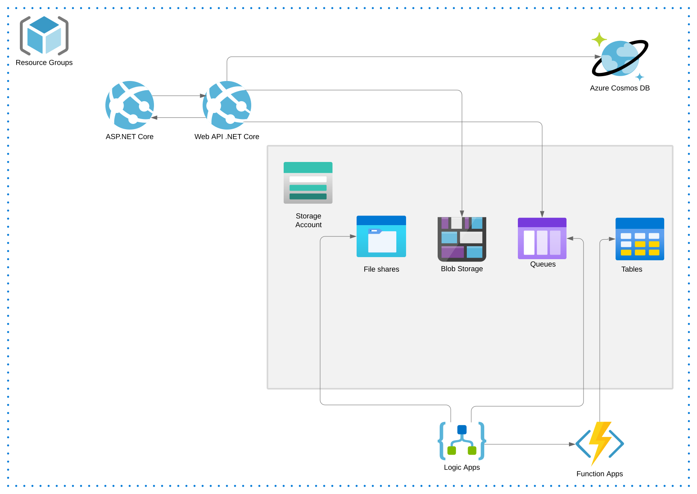
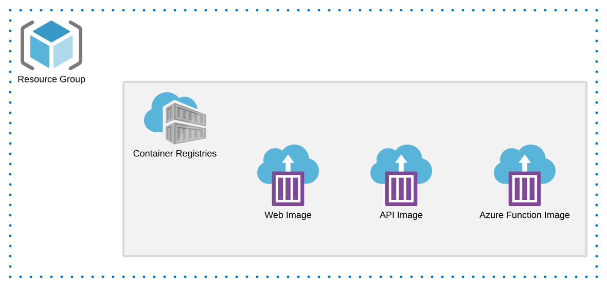

# .NET Sample Reference Application

Sample .NET Core native Azure cloud reference application.

### Architecture overview

### ARM Template

### Getting Started

In order to use ARM Template one would need to do the following

- Build source code
- Create docker images for 3 projects
  * LomographyStoreFuncs
  * LomographyStoreWeb
  * LomographyStoreApi
- Create a Resource Group with Container registry in Azure
- Deploy docker images to container registry 
- In ARM template provide username (variable "dockerregistry_username) and passwort (variable "dockerregistry_password") to access container registry , docker images names (variables "dockerimage_lomostoreapi", "dockerimage_lomostorefuncapp" and "dockerimage_lomostoreweb") and a login server link to container registry (variables "dockerregistry_domane" and "dockerregistry_url")
